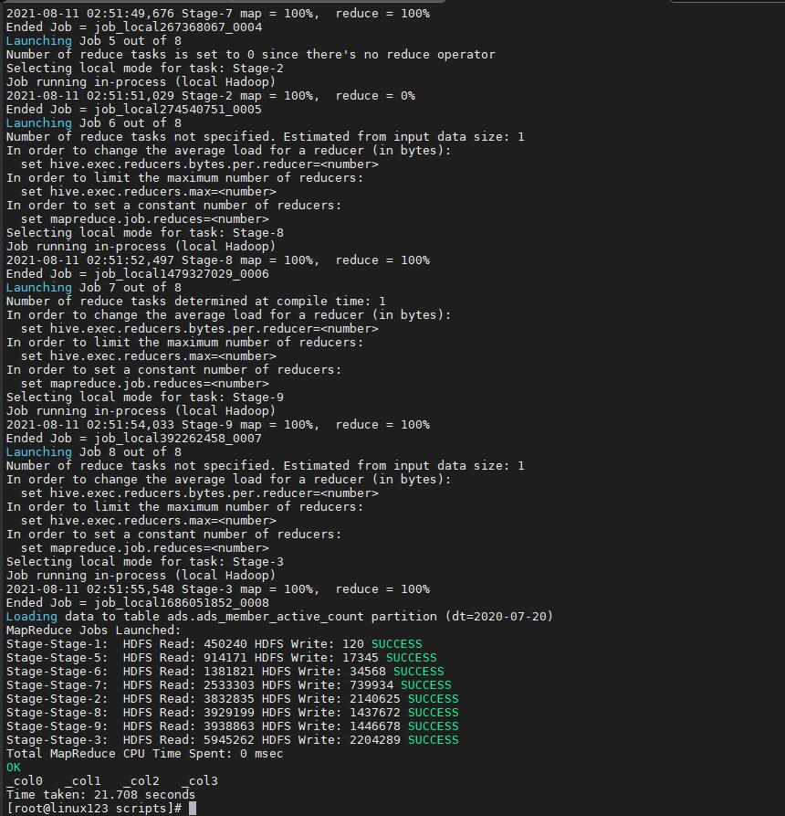
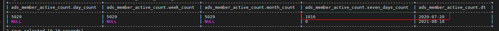
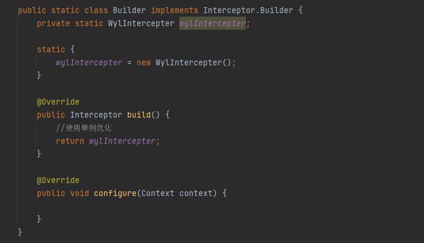

## 

### 一、近七天活跃会员数量

ADS层:

计算当天、当周、当月、最近七天活跃会员数量

```sql
drop table if exists ads.ads_member_active_count; 
create table ads.ads_member_active_count( 
`day_count` int COMMENT '当日会员数量', 
`week_count` int COMMENT '当周会员数量', 
`month_count` int COMMENT '当月会员数量',
`seven_days_count` int COMMENT '近七天活跃会员数量')
COMMENT '活跃会员数' partitioned by(dt string) row format delimited fields terminated by ',';
```

加载 ADS 层数据

ads_load_member_active.sh

```shell
#!/bin/bash 
source /etc/profile 
if [ -n "$1" ] 
then 
do_date=$1 
else 
do_date=`date -d "-1 day" +%F` 
fi
sql=" 
with tmp as( 
select 'day' datelabel, count(*) cnt, dt from dws.dws_member_start_day where dt='$do_date' group by dt 
union all 
select 'week' datelabel, count(*) cnt, dt from dws.dws_member_start_week where dt='$do_date' group by dt 
union all 
select 'month' datelabel, count(*) cnt, dt from dws.dws_member_start_month where dt='$do_date' group by dt
union all 
select 'seven_days_count' datelabel, count(device_id) cnt, '$do_date' dt from (
 select device_id,count(gid) as lxnum from(
  select device_id,dt,date_sub(dt,rn) as gid from (
   select device_id,dt,row_number() over(partition by device_id order by dt) as rn
   from dws.dws_member_start_day where dt>=date_sub('$do_date',7))tmp
  )tmp2
 group by device_id having count(gid)>=3)tmp3
 )

insert overwrite table ads.ads_member_active_count partition(dt='$do_date') 
select 
sum(case when datelabel='day' then cnt end) as day_count, 
sum(case when datelabel='week' then cnt end) as week_count, 
sum(case when datelabel='month' then cnt end) as month_count,
sum(case when datelabel='seven_days_count' then cnt end) as seven_days_count
from tmp group by dt; "

hive -e "$sql"
```

###### 结果截图:





### 二、数据采集优化

##### 2.1.flume拦截器中的Build类做了单例



##### 2.2.将Hive的执行引擎更换成tez

在$HIVE_HOME/conf/hive-site.xml 中增加

```
<property><name>hive.execution.engine</name> <value>tez</value> </property>
```

