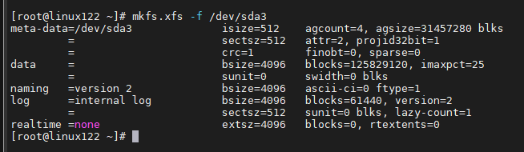

## 分区扩容

给centos7 已使用硬盘扩容:

### fdisk -l 查看分区情况

### 选择新增的硬盘并创建分区

fdisk /dev/sda

### 查看磁盘类型 df -Th   xfs类型还是ext4类型

### reboot  

不重启的话下一步格式化会报错

### 格式化分区

格式化/dev/sdb1分区 xfs类型 mkfs.xfs -f /dev/sdb1  ext4类型 mkfs.ext4 /dev/sda4 或者 mke2fs -t ext4 /dev/sda4

### 创建新PV

将/dev/sda3 创建新PV

pvcreate /dev/sda3

### 扩容卷组

创建卷组把新增容量全部给centos卷组:

如果提示卷组已经存在,则先通过vgscan查看已存在卷组名称,默认是名称是centos，然后 vgextend centos /dev/sda3 添加PV到卷组

### 将容量全部扩容给指定LV

先查看所在卷组

lvdisplay

lvextend /dev/centos/root /dev/sda3

### 调整文件系统的大小

以便新分区可利用这个额外的空间

xfs_growfs  /dev/centos/root

扩容前：df -h

因扩容前忘记截图,用了另一台虚拟机截图

扩容后：

